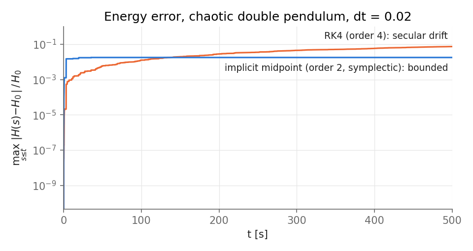
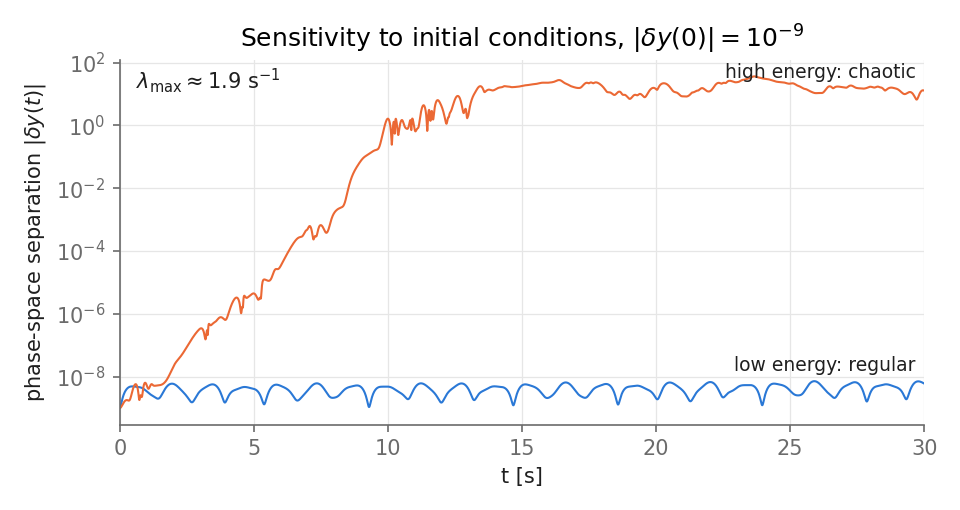

# 01 · N-link pendulum: Hamiltonian dynamics, symplectic integration, chaos

**Question.** For a planar chain of N point masses on rigid massless rods, how do the choice of integrator
and the energy regime shape what we can trust about long-time dynamics?

## Model

Absolute angles $q_i$ (from the downward vertical), conjugate momenta $p_i$. With
$A_{ij} = l_i l_j \sum_{k \ge \max(i,j)} m_k$:

$$
H(q,p) = \tfrac12\, p^\top M(q)^{-1} p \;+\; \sum_j g\, l_j \Big(\sum_{k\ge j} m_k\Big)(1-\cos q_j),
\qquad M_{ij}(q) = A_{ij}\cos(q_i - q_j).
$$

$$
\dot q = M^{-1}p, \qquad
\dot p_r = -g\, l_r \Big(\sum_{k\ge r} m_k\Big)\sin q_r \;-\; \dot q_r \sum_k A_{rk}\,\dot q_k \sin(q_r - q_k) \;+\; Q_r(t,q,\dot q).
$$

$H$ is **not separable** ($T$ depends on $q$ via $M(q)$) for $N \ge 2$, so explicit symplectic
Euler and leapfrog don't apply. I use the **implicit midpoint rule**, which is symplectic for any $H$.

Code: [`pendulum.py`](pendulum.py) (model), [`../../cplab/integrators.py`](../../cplab/integrators.py) (RK4, implicit midpoint).

## Validation ([`test_pendulum.py`](test_pendulum.py))

| Check | Result |
|---|---|
| `rhs` equals Hamilton's equations from finite differences of $H$ (N = 3, random state) | agrees to 1e-7 |
| Double-pendulum accelerations vs the textbook closed-form Lagrangian result | agrees to 1e-6 rel. |
| Single pendulum period vs the exact $T = 4\sqrt{l/g}\,K(\sin^2\tfrac{\theta_0}{2})$, up to $\theta_0 = 3$ rad | agrees to 1e-7 rel. |
| $M(q)$ symmetric positive definite (N = 4) | ✓ |
| One-step map $\Phi$ satisfies $D\Phi^\top J\, D\Phi = J$ for implicit midpoint, not for RK4 | ✓ |
| Convergence orders 4 (RK4) and 2 (midpoint); exact conservation of quadratic invariants | ✓ (`cplab/test_integrators.py`) |

## Results

Reproduce with `python projects/01-pendulum/experiments.py` (≈20 s).

**Energy error over long times.** Double pendulum ($m = l = 1$, $\theta_0 = (2.0, 2.5)$ rad, chaotic), $\Delta t = 0.02$.

RK4 is more accurate at first, but its energy error grows steadily (7 % by t = 500 s). The symplectic,
lower-order midpoint rule keeps the error bounded (≈2 %, no drift), because it exactly conserves a
nearby "shadow" Hamiltonian (backward error analysis). The two cross at t ≈ 140 s.

**Sensitivity to initial conditions.** Two trajectories separated by $10^{-9}$, integrated with DOP853 at rtol = 1e-12.

At low energy the separation stays bounded (quasi-periodic motion). At high energy it grows exponentially until
it saturates at the size of the accessible phase space. A linear fit gives a largest Lyapunov exponent of $\lambda_{\max} \approx 1.9\ \mathrm{s^{-1}}$,
which sets a predictability horizon of $\sim \lambda^{-1}\ln(1/\delta_0) \approx 10$ s.

## Lessons

- Higher order is not better in the long run. For long Hamiltonian runs, *structure preservation* beats local accuracy.
- An earlier version (an interactive web app, in git history at `9f0e6ec`) had a step labelled "symplectic Euler"
  that updated $p$ explicitly with $\dot p(q_n, p_n)$. That is symplectic only for separable $H$. For the double pendulum, its
  Jacobian determinant is 1.029 per step, so it doesn't even preserve phase-space volume. The tests here exist to catch exactly this.
- A single-trajectory "Lyapunov exponent" is a rough estimate. The proper method is Benettin's algorithm (tangent dynamics + periodic renormalisation).

## Possible extensions

Benettin's Lyapunov spectrum · Poincaré sections vs energy (KAM breakdown) · driven damped pendulum and its bifurcation diagram.
