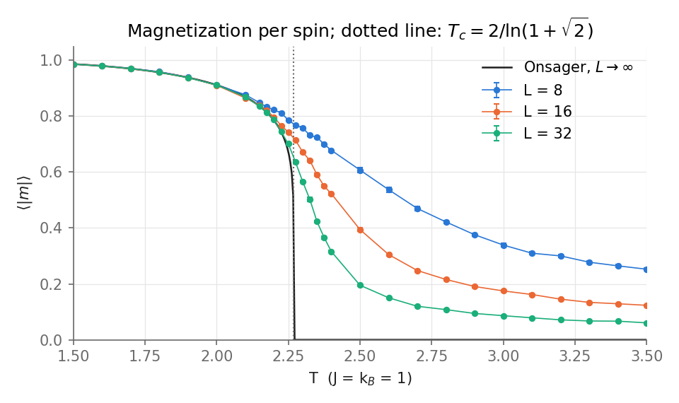
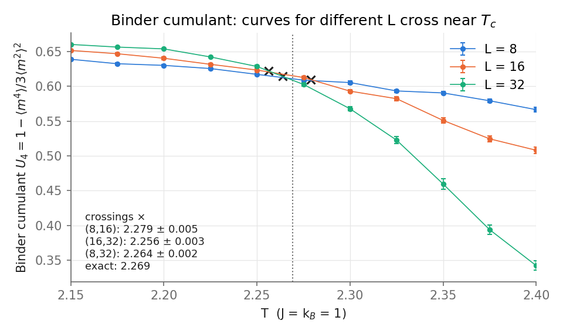
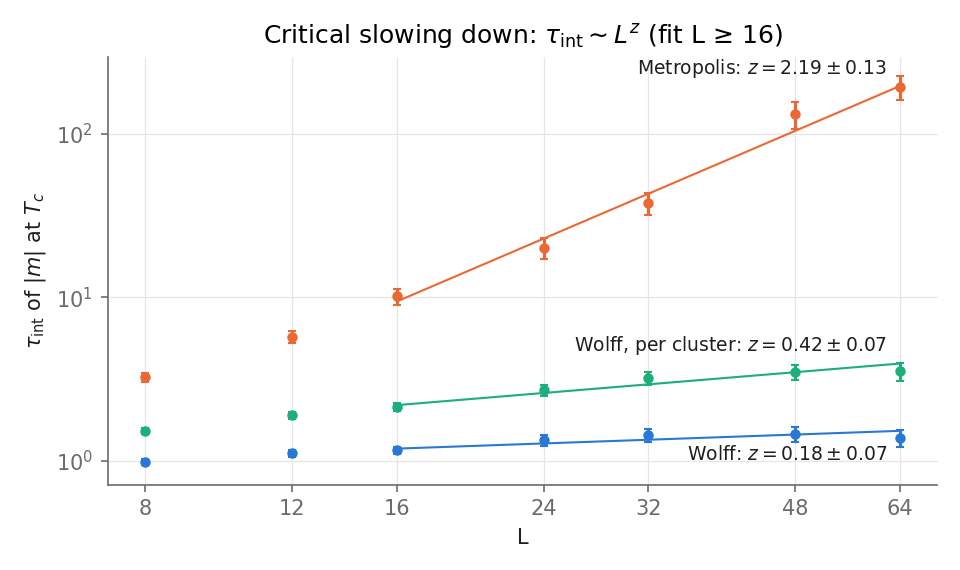

# 02 · 2D Ising model: locating the critical point, and why local updates fail near it

**Question.** Can a small Monte Carlo study locate the critical temperature of the 2D Ising model,
and why do local updates fail near it?

## Model

Spins $s_i = \pm 1$ on an $L \times L$ square lattice with periodic boundaries, $J = 1$, $h = 0$, $k_B = 1$:

$$
E(s) = -\sum_{\langle ij \rangle} s_i s_j, \qquad P(s) \propto e^{-E(s)/T}.
$$

Onsager's exact solution gives $T_c = 2/\ln(1+\sqrt2) = 2.26919\ldots$, the energy per spin $u(T)$ and the
spontaneous magnetization $m(T) = \big(1 - \sinh^{-4}(2/T)\big)^{1/8}$ for $T < T_c$ (zero above).

**Metropolis (local).** Flipping one spin costs $\Delta E = 2 s_i \sum_{j \in \mathrm{nn}(i)} s_j \in \{0,\pm4,\pm8\}$ and is accepted with probability $\min(1, e^{-\Delta E/T})$.
Same-colour sites of a checkerboard share no bond, so each sublattice is updated at once with NumPy (exact Metropolis, no Python loop over sites).
A sweep is one update of both sublattices.

**Wolff (cluster).** Grow a cluster from a random seed, adding each parallel neighbour with probability $p = 1 - e^{-2/T}$, then flip the
whole cluster. This satisfies detailed balance with acceptance 1. The clusters are the correlated domains, so their size follows the correlation length.
One cluster flip moves $\langle C \rangle$ spins, so I measure time in *sweep equivalents* $= (\text{cluster flips}) \times \langle C\rangle / N$.

**Statistics.** Errors on means use blocking (pairwise block averages until the error plateaus); errors on the Binder cumulant use a blocked jackknife (20 blocks).
The integrated autocorrelation time is $\tau_{\mathrm{int}} = \tfrac12 + \sum_{t=1}^{W} \rho(t)$ with Sokal's automatic window (smallest $W \ge 6\,\tau_{\mathrm{int}}(W)$).
Near $T_c$, $\tau_{\mathrm{int}} \sim L^{z}$.

Binder cumulant: $U_4 = 1 - \dfrac{\langle m^4 \rangle}{3 \langle m^2 \rangle^2}$, with $m = \frac1N \sum_i s_i$. At $T_c$ it is independent of $L$, so curves for different $L$ cross there.

Code: [`ising.py`](ising.py) (model, algorithms, exact references, statistics).

## Validation ([`test_ising.py`](test_ising.py), 10 s for the whole file)

| Check | Result |
|---|---|
| Local $\Delta E = 2 s_i \sum s_j$ vs the global energy difference $E(s') - E(s)$, random states and sites, $L = 4, 5, 8$ | identical (integers) |
| $\beta = 0$: every proposal accepted, so a sweep gives $s \to -s$; same seed gives the same state | ✓ |
| Metropolis $L=4$ (12 000 sweeps) vs exact enumeration of all $2^{16}$ states, $\langle e \rangle$ and $\langle \lvert m \rvert \rangle$ at $T = 2, 3$ | all within 1.2 standard errors (limit in test: 4) |
| Wolff $L=4$ (12 000 sweep equivalents), same four quantities | all within 0.9 standard errors |
| Metropolis $L = 32$, energy per spin vs Onsager $u(T)$ | $T=1.5$: $-1.95157(47)$ vs $-1.95112$; $T=3.5$: $-0.66333(125)$ vs $-0.66012$ |
| Onsager limits: $u(0.2)+2 = 0$ to $10^{-6}$; $u(10^3) = -0.0020000 \approx -2\beta$; $u$ monotone in $T$; $m(2.0) = 0.911319$ (hand calculation) | ✓ |
| Statistics on an AR(1) process ($a = 0.9$, exact $\tau_{\mathrm{int}} = 9.5$) | $\tau_{\mathrm{int}} = 9.94 \pm 0.35$; blocking error within 4 % of $\sigma_x\sqrt{2\tau/n}$ |
| White noise | $\tau_{\mathrm{int}} = 0.493 \pm 0.004$, blocking error 0.00232 vs $1/\sqrt n = 0.00224$ |

The $L=32$ test tolerance is plain $4\sigma$ (away from $T_c$, $\xi \lesssim 2$, so finite-size effects $\sim e^{-L/\xi}$ are negligible).
The $T = 3.5$ test seed sits at $-2.6\sigma$, but an independent check (8 other seeds, 10 000 sweeps each) pooled to $+1.8\sigma$, so there is no detectable bias.

## Results

Reproduce with `python projects/02-ising/experiments.py` (≈ 6 min on this machine, single core; Wolff clusters are grown in a Python loop).
Wolff production runs ($L = 8, 16, 32$, 2000 to 5000 measurements of one sweep-equivalent each per temperature) feed the first two figures.

**Magnetization.**

Below $T_c$ the finite lattices sit on the Onsager curve: at $T=2.0$, $\langle |m| \rangle = 0.9112(36), 0.9107(22), 0.9115(8)$ for $L = 8, 16, 32$ vs $0.91132$.
Above $T_c$ the exact $m$ is zero but a finite lattice has $\langle |m| \rangle \sim 1/L$ (at $T = 3.5$: $0.2525(40), 0.1233(22), 0.0606(11)$, halving with each doubling of $L$).
The transition is therefore rounded, with a size-dependent shoulder, and the magnetization curves alone give no sharp $T_c$ at these sizes.

**Binder cumulant and $T_c$.**

$U_4$ goes to $2/3$ in the ordered phase and to $0$ in the disordered one, and the steepness grows with $L$, so the curves cross near $T_c$ at $U_4 \approx 0.61$ (literature, periodic square lattice: $U^* = 0.61069\ldots$ [2]).
Quadratic fits of $U_4(T)$ on $[2.20, 2.35]$ give the pairwise crossings (error from a parametric bootstrap over the data errors, statistics only):

| pair | $T_\times$ | vs exact 2.2692 |
|---|---|---|
| (8, 16) | 2.279 ± 0.005 | +0.43 % |
| (16, 32) | 2.256 ± 0.003 | −0.56 % |
| (8, 32) | 2.264 ± 0.002 | −0.23 % |

So $T_c = 2.26 \pm 0.01$ (the spread of the three pairs), and every pair is within 1 % of the exact value. The spread is larger than the statistical errors, which
means the dominant uncertainty here is systematic: the fit model and corrections to scaling at small $L$, not the sampling noise.

**Critical slowing down.** $\tau_{\mathrm{int}}$ of $|m|$ at $T_c$, in sweeps (Wolff converted via $\langle C \rangle / N$):

| $L$ | Metropolis [sweeps] | Wolff [sweeps] | Wolff [cluster flips] | $\langle C\rangle/N$ |
|---|---|---|---|---|
| 8 | 3.24 ± 0.21 | 0.98 ± 0.05 | 1.53 ± 0.07 | 0.645 |
| 12 | 5.74 ± 0.48 | 1.11 ± 0.06 | 1.90 ± 0.10 | 0.583 |
| 16 | 10.1 ± 1.1 | 1.16 ± 0.06 | 2.13 ± 0.11 | 0.543 |
| 24 | 20.0 ± 2.9 | 1.33 ± 0.10 | 2.70 ± 0.21 | 0.493 |
| 32 | 37.6 ± 5.6 | 1.43 ± 0.13 | 3.19 ± 0.29 | 0.449 |
| 48 | 132 ± 24 | 1.46 ± 0.15 | 3.48 ± 0.36 | 0.418 |
| 64 | 192 ± 32 | 1.38 ± 0.17 | 3.53 ± 0.43 | 0.392 |

Weighted power-law fits for $L \ge 16$ give $z = 2.19 \pm 0.13$ for Metropolis (literature: $2.1665(12)$ [1]), $z = 0.18 \pm 0.07$ for Wolff in sweeps and $0.42 \pm 0.07$ per cluster flip.
The two Wolff exponents differ by the growth of the cluster fraction: $\langle C \rangle / N$ falls from 0.645 to 0.392 between $L = 8$ and 64, roughly $L^{-1/4}$ as expected from $\langle C \rangle \sim \chi \sim L^{7/4}$.
A local update changes one spin, so it has to diffuse a domain of size $\xi \sim L$ around, which costs $\sim L^2$ sweeps. A cluster update flips such a domain in one move.
At $L = 64$ Metropolis needs about 140 times more sweeps per independent sample. In wall time the gap is smaller, because my vectorised Metropolis sweep (0.12 to 0.24 ms) is much cheaper than a
Python-loop Wolff sweep-equivalent (≈ 0.5 ms at $L=16$, 1.8 ms at $L=32$), but Wolff already wins at $L = 16$ and the advantage grows as $L^{2}$.

## Lessons

- **Critical slowing down is a property of the dynamics, not of the physics.** Same distribution, same $T_c$, but $z \approx 2.2$ vs $z \lesssim 0.4$ depending on the update.
- **A cluster-size-dependent measurement rule biased the Wolff results.** My first version measured after "at least $N$ spins have been flipped". That stopping rule depends on the cluster sizes,
  which depend on the state, and it gave $\langle e \rangle = -1.237$ vs the exact $-1.017$ for $L=4$, $T=3$. The $L=4$ enumeration test caught it. The fix is a fixed number of cluster flips per measurement, calibrated after burn-in.
- **Fit choices matter more than the error bars.** A quadratic fit of $U_4$ over the wider window $[2.15, 2.40]$ gave $T_\times(16,32) = 2.248$, 0.9 % low, with a bootstrap error of 0.002, because the curves bend.
  Narrowing to $[2.20, 2.35]$ gives 2.256. Three other seeds (ad hoc, not in `experiments.py`) put that pair at 2.262 to 2.266, so this particular run's pair estimates have a scatter of about 0.01, not 0.003.
  The quoted errors are statistical only, and three sizes are too few to extrapolate the crossings.
- **Small $L$ limits the exponents.** Between $L = 8$ and 16 the Metropolis effective slope is only 1.6, so I fit $L \ge 16$ (5 points); the $\tau_{\mathrm{int}}$ errors are 6 to 19 % even with $\approx 40\,L^2$ sweeps,
  and the $L = 48$ point lies visibly above the fit. The Wolff sweep-unit $\tau$ is almost flat for $L \ge 24$, so $z = 0.18 \pm 0.07$ cannot distinguish a small power from a logarithm.
- Windowed $\tau_{\mathrm{int}}$ has relative error $\sqrt{(4W+2)/n} \approx \sqrt{26\,\tau/n}$, so even $n \approx 500\,\tau$ gives only ~20 %, and the Metropolis points at large $L$ are the expensive ones.

## References

1. M. P. Nightingale and H. W. J. Blöte, Phys. Rev. Lett. **76**, 4548 (1996): dynamic exponent $z = 2.1665(12)$ of single-spin-flip dynamics.
2. G. Kamieniarz and H. W. J. Blöte, J. Phys. A **26**, 201 (1993): universal ratio of magnetization moments, $U^* = 0.61069\ldots$.

## Possible extensions

Finite-size-scaling collapse of $\chi$ and $\langle|m|\rangle$ for $\beta/\nu = 1/8$, $\gamma/\nu = 7/4$ · histogram reweighting · Swendsen-Wang and a compiled Wolff · 3D Ising.
