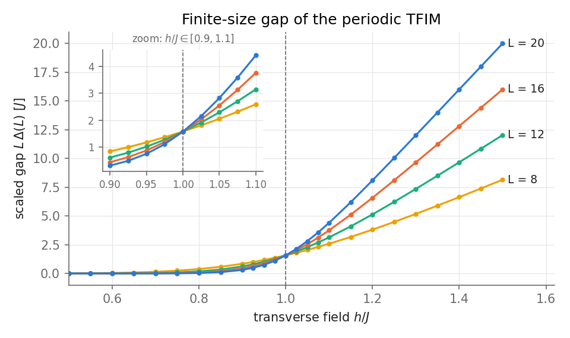
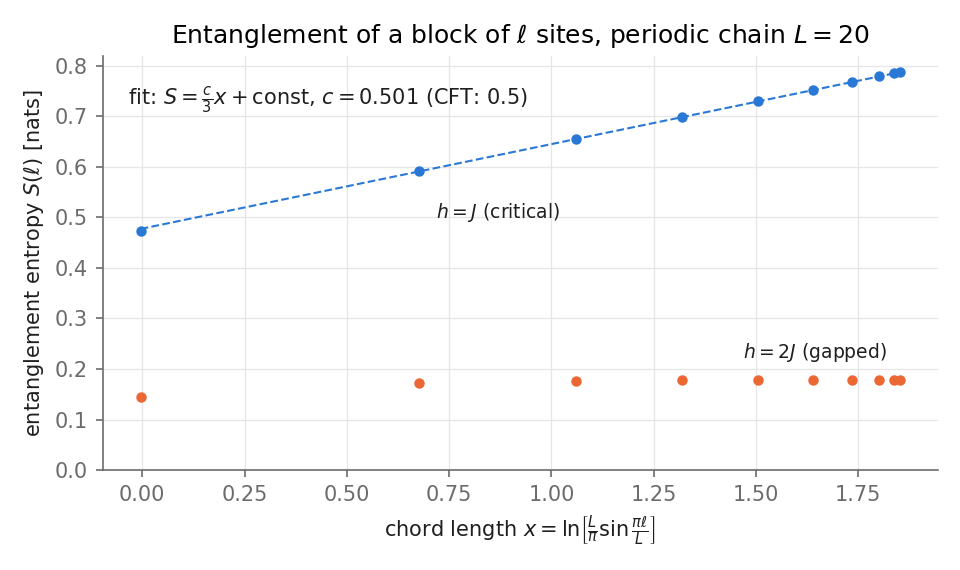

# 03 · Transverse-field Ising chain: a quantum phase transition in 20 spins

**Question.** How does a quantum phase transition show up in a finite chain of ~20 spins, in the energy gap
and in the entanglement of the ground state?

## Model

$L$ spin-1/2 sites with Pauli matrices $\sigma^{x,z}_i$, $J = 1$, periodic (PBC) or open (OBC) boundaries:

$$
H = -J \sum_i \sigma^z_i \sigma^z_{i+1} \;-\; h \sum_i \sigma^x_i .
$$

For $h \ll J$ the ground state is a ferromagnet (two-fold degenerate in the thermodynamic limit); for $h \gg J$ it is a
paramagnet polarised along $x$. The transition at $h_c = J$ is described by a $c = 1/2$ conformal field theory with
dynamical exponent $z = 1$. Two finite-size consequences used below:

- **Gap.** $\Delta(L) = E_1 - E_0 \to 2\pi v\, x / L$ at criticality, so $L\,\Delta(L)$ is $L$-independent at $h_c$ (curves for
  different $L$ cross). The lowest excitation in the PBC chain is the spin operator $\sigma$ ($x = 1/8$), and the velocity is
  $v = 2J$, so $L\,\Delta \to \pi/2$.
- **Entanglement.** For a block of $\ell$ sites in a periodic chain of length $L$ (Calabrese–Cardy),
  $S(\ell) = \tfrac{c}{3}\ln\!\big[\tfrac{L}{\pi}\sin\tfrac{\pi\ell}{L}\big] + \text{const}$. Away from criticality $S$ saturates (area law).

**Exact diagonalization.** Basis state $s = \sum_i b_i 2^i$ with $\sigma^z_i = 1 - 2b_i$. $\sigma^z\sigma^z$ is diagonal
(parity of $b_i \oplus b_{i+1}$) and $\sigma^x_i$ flips bit $i$ (XOR with $2^i$), so the sparse $2^L \times 2^L$ matrix is built
with vectorised bit operations. The lowest eigenpairs come from Lanczos (`eigsh`), dense `eigh` for $L \le 10$. At $L = 20$
($\approx 10^6$ states) building takes ≈1.3 s and the two lowest states ≈10–15 s.

**Free-fermion reference.** A Jordan–Wigner transformation with $\sigma^x_i = 1 - 2c_i^\dagger c_i$ gives
$H = \sum_{ij} c^\dagger_i A_{ij} c_j + \tfrac12 (c^\dagger_i B_{ij} c^\dagger_j + \text{h.c.}) - hL$ with $A$ symmetric,
$B$ antisymmetric. The Lieb–Schultz–Mattis result is $E_0 = -\tfrac12 \sum_k \varepsilon_k$, where $\varepsilon_k$ are the
singular values of $A - B$ (for OBC, $A - B = 2h\,\mathbb 1 - 2J\,\mathbb{S}$ with $\mathbb S$ the lower shift matrix). For PBC and even $L$ the ground state
lies in the even-parity (antiperiodic) sector:

$$
E_0 = -\sum_{k} \sqrt{J^2 + h^2 - 2Jh\cos k}, \qquad k = \pm\tfrac{(2n-1)\pi}{L},\ n = 1,\dots,L/2 .
$$

Code: [`tfim.py`](tfim.py).

## Validation ([`test_tfim.py`](test_tfim.py))

| Check | Result |
|---|---|
| Bit-operation Hamiltonian vs an independent dense Kronecker-product build (L = 5, PBC and OBC) | identical to 1e-14 |
| $H$ Hermitian (PBC and OBC, $J \ne 1$) | exactly symmetric |
| L = 2 OBC spectrum vs analytic $\pm J$, $\pm\sqrt{J^2 + 4h^2}$ | agrees to 1e-13 |
| Free-fermion $E_0$ limits: $h = 0 \to -LJ$ (PBC), $-(L-1)J$ (OBC); $J = 0 \to -Lh$ | ✓ |
| ED $E_0$ vs free-fermion $E_0$, PBC and OBC, $L \in \{6, 8, 10\}$, $h \in \{0.3, 1, 2.5\}$ | max error 2e-14 |
| Same at $L = 12$ through the Lanczos path (PBC, $h = 1$) | 1e-14 |
| Entropy: product state ($J = 0$) → 0; Bell pair → $\ln 2$; $S(\ell) = S(L-\ell)$ | ✓ |
| Hellmann–Feynman: $\langle\sigma^x\rangle = -\partial_h (E_0/L)$, $L = 8$, $h = 0.8$, finite difference | agrees to ≈2e-9 (PBC and OBC) |
| $E_0 = -L(J\langle\sigma^z\sigma^z\rangle + h\langle\sigma^x\rangle)$ from the ground state (PBC, $L = 8$) | agrees to 1e-10 |
| Gap limits: $J = 0 \Rightarrow \Delta = 2h$; $h = 0$ (PBC) $\Rightarrow \Delta = 0$; $L\,\Delta(h = 1, L = 10) = 1.574$ vs $\pi/2 = 1.571$ | ✓ |

## Results

Reproduce with `python projects/03-spin-chain/experiments.py` (≈7 min, dominated by the $L = 20$ Lanczos runs).

**Gap.** $L\,\Delta(L)$ for periodic chains, $L = 8, 12, 16, 20$.

The curves cross at the critical point: pairwise crossings (cubic-spline interpolation on the $h$ grid) are
$h_c \approx 1.0007$ ($L = 8, 12$), $1.0002$ ($12, 16$) and $1.0001$ ($16, 20$), converging to $h_c = J$. At $h = J$,
$L\,\Delta = 1.5759, 1.5730, 1.5721, 1.5716$ for $L = 8, \dots, 20$, approaching the CFT value $\pi/2 = 1.5708$ with
$z = 1$. For $h < J$ the periodic gap is the splitting of the near-degenerate parity pair, exponentially small in $L$
(e.g. $\Delta = 1.5\times10^{-4}$ at $h = 0.7$, $L = 20$), hence $L\,\Delta \approx 0$ there; for $h > J$ it is a true single-particle gap,
$L\,\Delta \propto L$.

**Entanglement.** Ground state of the periodic $L = 20$ chain, block of $\ell$ sites, plotted against the chord length $x$.

At $h = J$, $S$ is a straight line in $x$; a fit over $\ell = 2, \dots, 10$ gives $c = 0.501$ against the CFT value $0.5$
(starting the fit at $\ell_{\min} = 1, 2, 3$ gives $c = 0.506, 0.501, 0.501$). At $h = 2J$ the entropy saturates once $\ell$ exceeds the correlation length: $S = 0.145, 0.172, 0.1765$ for $\ell = 1, 2, 3$ and
$0.178$ for all $\ell \ge 5$, independent of block size (area law). So the central charge can be read off from 20 spins, with a systematic uncertainty of about 1 % from the choice of fit window.

## Lessons

- Finite-size scaling does the work: no single $L$ shows a transition, but the *crossing* of $L\,\Delta(L)$ does, and it
  lands within $10^{-3}$ of $h_c$ already at $L = 8$–12.
- In PBC the "gap" below $h_c$ is not a gap in the usual sense: the two lowest states are the ferromagnetic parity pair. Keeping this
  (rather than taking $E_2 - E_0$) is what makes $L\,\Delta$ vanish for $h < J$ and the crossing well defined.
- The quantity of interest at $h < J$ is a tiny difference between two near-degenerate eigenvalues, so Lanczos accuracy matters. I use the `eigsh` default
  tolerance (machine precision) and a fixed start vector (deterministic). A looser `tol=1e-10` was faster (e.g. 9.5 s vs 15.2 s at $h = 1$, $L = 20$) but changed the
  gap by up to 1e-12 (at $h = 0.5$, $\Delta = 2.149\times10^{-7}$, a 5e-6 relative change), so I kept the default. I did not use translation or parity symmetries, which would make larger $L$ cheaper; $L = 20$ at 10–15 s per point is
  the practical limit of this simple version.
- The fitted $c = 0.501$ depends a little on the fit window ($\ell_{\min} = 1, 2, 3$: 0.506, 0.501, 0.501), so the 0.3 % agreement is partly luck; a quoted uncertainty of
  ~1 % is more honest. Free-fermion correlation-matrix methods would reach $L \sim 10^3$ and show the approach to $c = 1/2$ properly, but I did not implement that.
- The free-fermion solution is the real test of the ED code: a wrong sign or bond count gives errors of order 1, not 1e-14.

## Possible extensions

Free-fermion entanglement at large $L$ · translation/parity symmetry blocks to reach $L \sim 28$ · critical exponents $\nu$, $\beta$ by data collapse · quench dynamics (Kibble–Zurek).
